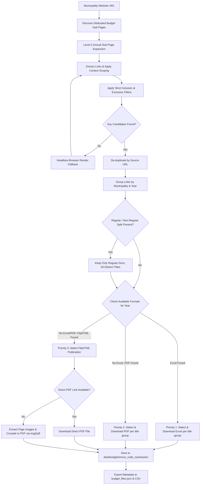

# Municipal Budget File Scraping Architecture

This document describes the design, strict filtering scope, multi-level sub-page crawling, format prioritization hierarchy, and download/conversion pipeline implemented in `budget_files.py` ([src/muni_budget_analysis/scrapers/budget_files.py](../src/muni_budget_analysis/scrapers/budget_files.py)) for scraping municipal budget files across all Israeli local authorities.

---

## 1. Strict Scope Enforcement

To ensure only actual annual municipal budget documents are downloaded and analyzed (excluding generic forms, tenders, or accessibility documents), the scraper enforces strict inclusion and exclusion keyword rules loaded from the single config file at `src/muni_budget_analysis/config/budget_keywords.json` (or a custom path passed via `-c`/`--config`). There are no hardcoded default keywords and no alternate fallback location: if the config file is missing or fails to parse, this is logged as an **error** and both keyword lists come back empty, rather than silently scraping with stale defaults or a second copy of the file elsewhere.

### Inclusion Keywords (`STRICT_BUDGET_INCLUSIONS`)
A budget inclusion keyword (e.g. `תקציב`, `ספר תקציב`, `חוברת תקציב`, `תקציב רגיל`, `תקציב מותאם`, `תבר`, `תב"ר`, `הצעת תקציב`, `עיקרי התקציב`, `תמצית תקציב`, `ספר תוכניות`) must appear in the link's own text, its URL, **or** its surrounding context (see [context scoping](#context-scoping) below) - the context fallback exists specifically for generic link text like `"לחץ כאן"` or `"להורדה"`.

### Exclusion Keywords (`STRICT_EXCLUSIONS`)
A link is rejected if any of the following non-budget categories appear in its own text, its URL, **or its tight local context only** (never page-wide context - see below). This list grows in an ad-hoc way as new false positives are found in practice, so treat the categories below as illustrative, not exhaustive - **`src/muni_budget_analysis/config/budget_keywords.json` is always the current source of truth** for the exact list:
- **FOI, Accessibility & Public Info**: `חופש המידע`, `ממונה`, `דיווח ממונה`, `דוח_ממונה`, `הנגשה`, `גזרי מידע`
- **Forms, Tenders & Suppliers**: `טופס`, `טפסים`, `בקשה`, `ספקים`, `מכרז`, `מכרזים`, `ארנונה`, `פרוטוקול`, `אגרת`, `רישום`, `הנחיות`
- **Audited Financial Statements & Reports**: `מבוקר`, `דו"ח כספי`, `דוח כספי`, `דוח חתום`, `דו"ח חתום`, `רבעון`, `רבעוני` (quarterly reports)
- **Local Committees, Development & Municipal Departments**: `וועדים`, `ועדים`, `ועדה`, `ועד מקומי`, `נציגי ציבור`, `תקציב פיתוח`, `תקציב_פיתוח`, `פיתוח`, `ptuach`, `הנהלה`, `הנדסה`, `מתאר`, `רשות המים`
- **Municipal Services Unrelated to Budget**: `מזון`, `גני ילדים`, `גן המשחקים`, `גינות`, `גנים`, `היחידה הסביבתית`, `מיחזור`, `תברואה`, `חוגים`, `עסקים`, `תמיכות`, `בידוד`, `תעבורה`, `מקלטים`, `מיסים`, `זכויות`, `מבנים`, `מדיניות`

Every exclusion keyword lives in one flat JSON list regardless of category - the categories above are purely for readability in this doc.

Every exclusion match is logged (`Excluding candidate '...' (...): matched exclusion keyword(s) [...]`) so false positives are traceable back to the exact keyword that fired.

### Context Scoping

Inclusion and exclusion checks deliberately use **different** scopes of surrounding context, because they were found to fail in opposite directions when treated the same:

- **Page-wide context** (page URL, `<title>`, and the page's main heading - the first `<h1>`, falling back to the first `<h2>` if no `<h1>` exists) is used **only for inclusion fallback**. It is never used to exclude a link. Page-wide elements (a footer accessibility statement, a sitewide "advanced search" widget, an FOI heading) are shared by every link on the page - using them for exclusion caused unrelated, legitimate budget files to be rejected just because *something else* on the same page mentioned an excluded topic.
- **Local context** (the nearest `<tr>`, `<li>`, or `<p>` ancestor of the link; a `<div>` ancestor is only used as a fallback if it contains 5 or fewer `<a>` tags, to avoid pulling in a large wrapping section's unrelated sibling links) is specific enough to the individual link to be used for **both** inclusion and exclusion.

---

## 2. Sub-Page Crawling & Context Inheritance

To discover budget files hosted inside dedicated sub-pages (e.g. `/תקציבים/`, `/תקציב-לשנת-הכספים-2021/`, or FlipHTML5 flipbook wrappers):

1. **Level-1 Sub-Page Discovery**: Homepage navigation links containing `תקציב`, `ספר תקציב`, or `גזברות` are queued and prioritized.
2. **Level-2 Sub-Page Expansion**: Annual sub-pages linked from main budget indexes (e.g. `/תקציב-לשנת-הכספים-2021/`) are crawled to extract embedded `<iframe>`, `<embed>`, or PDF download buttons. A link mentioning `תקציב` is always queued; a link with only a bare year (e.g. `2021`) is queued only if the *page it was found on* is itself already budget-related (its own URL contains `תקציב`) - otherwise a bare year match on a generic page (e.g. a "Strategic Plan 2026" page) would incorrectly pull unrelated pages into the crawl scope.
3. **Container Context Inheritance**: See [Context Scoping](#context-scoping) above.
4. **Session & Redirect Loop Handling**: Uses `urllib.request.HTTPCookieProcessor` to resolve HTTP 302 redirect loops on municipal web gateways (e.g. `shaffir.org.il`, `gezer-region.muni.il`).
5. **Headless-Browser Fallback for JS-Rendered Pages**: Some municipal "transparency portals" (e.g. Angular/SharePoint widgets, as seen on `tel-aviv.gov.il`) populate budget years/documents entirely client-side after page load - the plain HTTP response contains no file links at all. When the static-HTML scan (steps 1-4 above) finds zero candidates for a municipality, the scraper falls back to rendering the top 3 ranked pages with a headless Chromium browser (via Playwright), clicking any tab/accordion/button controls to reveal hidden content, then re-running the same link-extraction logic against the rendered DOM.
   - If `playwright` isn't installed, this is logged as a clear **warning** with install instructions, rather than silently returning nothing.
   - Clicking arbitrary controls can trigger unrelated social-share widgets (a `target="_blank"` link to `twitter.com/intent/tweet?...` built dynamically from the page's own title/URL). Any full-page or popup navigation to a different site is **aborted at the network-request level** (via a Playwright browser-context route handler) before the connection is ever made - reacting after the fact (closing the popup, navigating back) is too late to stop the outbound connection itself.
   - Navigation tolerates pages that never reach `networkidle` (common on sites with persistent background polling - chat widgets, analytics beacons): it retries with a much looser `load` wait rather than failing the whole page.

---

## 3. Format Priority Hierarchy

For every municipality and budget year (e.g. 2026, 2025, 2024, 2023...), the scraper enforces the following **format priority hierarchy**:

| Priority Level | Format Category | Target File Extensions | Action |
| :--- | :--- | :--- | :--- |
| **Priority 1** | **Excel Files** | `.xlsx`, `.xls`, `.csv` | Selected and downloaded as the primary structured data format. |
| **Priority 2** | **PDF Files** | `.pdf` | Selected ONLY if no Excel file exists for that municipality and year. |
| **Priority 3** | **FlipHTML5 Publications** | `fliphtml5.com`, `online.fliphtml5.com` | Selected ONLY if neither Excel nor PDF files exist for that year. Automatically converted to PDF. |

### FlipHTML5 Conversion (`convert_fliphtml_to_pdf`)

FlipHTML5-hosted publications are converted to PDF via, in order:

1. **Direct PDF download link** (`files/download/<book_id>.pdf`), if the publisher enabled it.
2. **Headless-browser page extraction**: FlipHTML5's per-page images are never present as static links (the only one in the plain HTML is the cover thumbnail, `files/shot.jpg`), and the reader's own page manifest is a proprietary-obfuscated blob inside `javascript/config.js` - not something regex can parse. Instead, the reader exposes a "thumbnail preview" panel whose items already exist in the DOM (hidden until toggled), one per page, each with an `aria-label="page N"`. The scraper opens this panel and clicks through every item, capturing each page's real `files/large/<hash>.<ext>` image via network response interception - keyed by page number, since the hashed filenames carry no inherent order. A couple of retry passes over whatever pages were missed on the first sweep improve completeness (the swiper appears to virtualize/recycle its DOM nodes while scrolling, which drops some clicks unpredictably). This is a best-effort process, not a guaranteed 100% capture - if fewer pages were captured than the panel reported existing, this is logged as a **warning** (`FlipHTML thumbnail capture incomplete for ...: got X of Y expected pages`) rather than silently producing an incomplete PDF unnoticed.
3. **Last resort - static HTML fallback**: parses the plain HTML response with BeautifulSoup for any ``/`<a>` tag whose `src`/`href`/`data-src` looks like a page image. In practice this is only ever the single cover thumbnail, so this path alone previously caused FlipHTML5 conversions to silently produce a 1-page PDF; it now only runs if the browser-based extraction above found nothing at all (e.g. Playwright isn't installed).

Whichever step produces image URLs, they're downloaded and assembled into the final PDF with **img2pdf** rather than Pillow - it embeds each image (JPEG/PNG/WebP) into the PDF losslessly, without Pillow's implicit re-encode/recompress step, and needs no image-library format conversion first.

### Regular vs. Non-Regular Budgets

Some municipalities (e.g. Tel Aviv) publish both a "regular" budget (`תקציב רגיל`/`רגיל`) and a "non-regular"/supplementary budget (`תקציב בלתי רגיל`/`בלתי רגיל`) for the same year, each with several distinct documents (a details book, a summary spreadsheet, explanatory notes, etc.). When a municipality's candidates for a year include this distinction:

- **Only the regular (`רגיל`, and specifically not `בלתי רגיל`) documents are kept.** Note `בלתי רגיל` literally contains the substring `רגיל`, so the check explicitly excludes it rather than just checking `"רגיל" in text`.
- **Every distinct regular document is kept**, not just one - a details book and a summary spreadsheet for the same year are different documents, not format variants of the same file. Documents are grouped by their exact link title, and only *within* a group (i.e. the same titled document available in more than one format) does the Excel > PDF > FlipHTML priority apply.

Municipalities with no regular/non-regular distinction in their document titles are unaffected - they keep the original single-best-file-per-year behavior above.

Candidates are also de-duplicated by source URL before this step, since the headless-render fallback's accordion clicking can surface the same document more than once.

---

## 4. Scraping & Conversion Pipeline



---

## 5. Directory Structure & Output Metadata

Downloaded files are organized into structured directories under `data/budgets/`:

```
data/budgets/
├── 30_מועצה_אזורית_גזר/
│   ├── 2026/
│   │   └── 1767518831.6266.pdf
│   ├── 2021/
│   │   └── 1661151002.3934.pdf
│   └── 2020/
│       └── 1663230393.2485.pdf
├── 39_מועצה_אזורית_מטה_יהודה/
│   ├── 2024/
│   │   └── 1719401425.4909.pdf
│   └── 2019/
│       └── 1551079219.7547.xlsx       # Selected Excel file over PDF
├── 4000_חיפה/
│   ├── 2026/
│   │   └── תקציב-רגיל-לשנת-2026.xlsx  # Regular budget Excel file
│   └── 2024/
│       └── פירוט-הוצאות-לשנת-2024.xlsx
├── 5000_תל_אביב_-יפו/
│   ├── 2025/
│   │   ├── תקציב-העירייה-הרגיל-לשנת-2025.xlsx     # Regular budget - Excel
│   │   ├── ספר-תקציב-רגיל---פירוט-2025.pdf        # Regular budget - details book (no Excel equivalent)
│   │   └── ...                                     # Every distinct regular document, "בלתי רגיל" excluded
├── budget_files.json                   # Detailed metadata JSON summary
└── budget_files.csv                    # Summary CSV report
```

The save filename is derived from the source URL's basename **after** percent-decoding, then re-derived through `Path(...).name` a second time - this strips any `../` traversal sequences a decoded URL segment could introduce (e.g. from a malicious or compromised municipal site), and a final check refuses to write anywhere outside the target municipality/year directory.

---

## 6. Execution & Verification Commands

The headless-browser fallback (section 2, item 5) requires the Playwright Chromium binary to be installed once, in addition to the pip package (already listed in `requirements.txt` / `pyproject.toml`):

```bash
pip install -r requirements.txt   # or: pip install playwright
playwright install chromium
```

Run the budget scraper for all municipalities:

```bash
python3 src/muni_budget_analysis/scrapers/budget_files.py
```

Or using the CLI entrypoint:

```bash
muni-scrape-budgets
```

Restrict the run to a single municipality, e.g. for testing or re-scraping one site:

```bash
python3 src/muni_budget_analysis/scrapers/budget_files.py --municipality-code 5000
python3 src/muni_budget_analysis/scrapers/budget_files.py --municipality-name "תל אביב"
```

Both flags can be combined; if nothing matches, the run exits immediately with an error instead of silently scraping everything.

### Concurrency

Both discovery and downloading run across a `ThreadPoolExecutor`, controlled by `-w`/`--workers` (default 10):

```bash
python3 src/muni_budget_analysis/scrapers/budget_files.py --workers 20
```

Each worker thread that hits a JS-rendered page creates its own independent `sync_playwright()` instance (Playwright's sync API is not shared across threads, but each thread using its own instance works correctly - verified under concurrent load). A headless render is much heavier per-thread than a plain HTTP fetch (30-60+ seconds, a real Chromium process), so if several municipalities needing the fallback land in the same batch, consider a lower worker count than the default to avoid overloading the machine.

Run test suite:

```bash
python3 -m unittest discover -s tests
```
