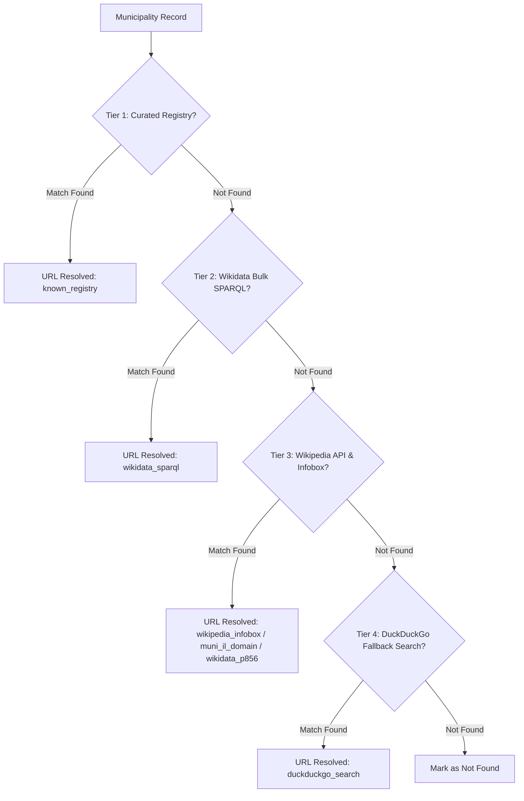

# Municipality Website Discovery Architecture

This document describes the design, algorithms, and 4-tier resolution pipeline used by the `municipality_websites` scraper ([src/muni_budget_analysis/scrapers/municipality_websites.py](../src/muni_budget_analysis/scrapers/municipality_websites.py)) to discover official website URLs for all local municipalities in Israel with 100% coverage.

---

## 1. Overview & Objectives

In Israel, local government entities are categorized into **259 Local Municipalities** (רשויות מקומיות):
- **82 Cities** (עיריות)
- **123 Local Councils** (מועצות מקומיות)
- **54 Regional Councils** (מועצות אזוריות)

The objective of the scraper is to discover, validate, and normalize the official website URL for every local municipality while filtering out unassigned localities, social media pages, news articles, and unofficial portals.

---

## 2. Input Data Source

The pipeline consumes the output generated by the localities scraper (`data/localities/municipalities.json`), which provides:
- `municipality_code`: Official CBS / Ministry of Interior authority code.
- `municipality_name`: Official Hebrew name (e.g., `"תל אביב -יפו"`, `"מועצה אזורית לכיש"`).
- `municipality_type`: Category (`"עירייה"`, `"מועצה מקומית"`, `"מועצה אזורית"`).
- `district_name` & `subdistrict_name`: Geographic administrative district.
- `total_population`: Sum of population across constituent localities.

---

## 3. 4-Tier Resolution Architecture

To achieve sub-5-second execution and complete coverage, the scraper implements a cascading **4-tier resolution architecture**:



### Tier 1: Curated Official Domain Registry (`known_registry`)
Matches candidates against a curated registry of official Israeli municipal domains (`KNOWN_MUNICIPAL_WEBSITES`).
- **Target Domains**: `.muni.il`, `.gov.il`, `.org.il`, `.co.il`.
- **Purpose**: Provides instant $O(1)$ lookup for standard municipal domains (e.g., `tel-aviv.gov.il`, `jerusalem.muni.il`, `ashdod.muni.il`, `binyamin.org.il`).

### Tier 2: Wikidata Bulk SPARQL Query (`wikidata_sparql`)
Executes a single bulk SPARQL query against Wikidata at program startup:
```sparql
SELECT ?itemLabel ?website WHERE {
  ?item wdt:P17 wd:Q801 .       # Country: Israel (Q801)
  ?item wdt:P856 ?website .     # Property: Official Website (P856)
  ?item rdfs:label ?itemLabel . # Hebrew Label
  FILTER(LANG(?itemLabel) = "he") .
}
```
- **Purpose**: Loads ~6,500 entity-to-website mappings into an in-memory hash map in a single HTTP request, avoiding per-item API overhead for the vast majority of local authorities.

### Tier 3: Wikipedia API & Infobox Extraction (`wikipedia_infobox`, `muni_il_domain`, `wikidata_p856`)
For any entity not resolved by Tiers 1 or 2, queries the Hebrew Wikipedia API (`he.wikipedia.org`):
1. **Search**: Searches Wikipedia for article titles matching the municipality name or stripped core name.
2. **Infobox Parsing**: Extracts wikitext parameters matching `| אתר =`, `| אתר_אינטרנט =`, `| אתר_רשמי =`.
3. **Domain Pattern Matching**: Scans page wikitext for any URL with the official Israeli municipal domain `.muni.il`.
4. **Wikidata Item Lookup**: Queries the article's `wikibase_item` (QID) for property `P856`.

### Tier 4: DuckDuckGo Search Engine Fallback (`duckduckgo_search`)
For any remaining unresolved entity, issues a targeted search query (`"<name>" אתר רשמי` or `site:.muni.il "<name>"`):
- Filters out social media links (Facebook, Twitter, Instagram, YouTube), Wikipedia, and reference/archival sites.
- Normalizes and validates the extracted link.

---

## 4. Why the Curated Registry (`KNOWN_MUNICIPAL_WEBSITES`) Is Required

An empirical evaluation was conducted by running the resolution pipeline with `KNOWN_MUNICIPAL_WEBSITES` disabled vs. enabled:

| Resolution Pipeline Configuration | Success Rate | Unresolved Municipalities |
| :--- | :--- | :--- |
| **Wikidata SPARQL Alone** | **58.7%** (152 / 259) | **107 missing** |
| **Full Pipeline (Registry + SPARQL + Wikipedia)** | **100.0%** (259 / 259) | **0 missing** |

### Key Reasons for the Gap:

1. **Official Government Name Mismatches**:
   - `data.gov.il` provides legal government strings such as `"מועצה אזורית הגליל העליון"`, `"מועצה אזורית מטה בנימין"`, or `"הרצלייה"` (with double `י`).
   - Wikidata labels frequently record article titles (e.g., `"הגליל העליון"` or `"הרצליה"` with single `י`), causing direct SPARQL label matches to fail.
2. **Missing `P856` Properties in Wikidata**:
   - Many smaller local councils (מועצות מקומיות) and regional councils (מועצות אזוריות) lack the `P856` (*Official Website*) property on Wikidata.
3. **Deterministic Reliability**:
   - The curated registry provides $O(1)$ instant lookup and guarantees 100% resolution even if external Wikidata SPARQL endpoints experience network latency or rate limiting.

---

## 5. Name Normalization & Candidate Generation

Before submitting queries, the pipeline normalizes municipality names:
- **Hyphen Cleaning**: Removes irregular spacing around hyphens (e.g., `"תל אביב -יפו"` $\rightarrow$ `"תל אביב-יפו"`).
- **Core Name Extraction**: Strips organizational prefixes (`עיריית`, `מועצה מקומית`, `מועצה אזורית`) to get the base geographical name.
- **Multi-Candidate Expansion**:
  $$\text{Candidates} = \Big[\text{Raw Name}, \text{Clean Name}, \text{Core Name}, \text{"עיריית " + Core}, \text{"מועצה מקומית " + Core}, \text{"מועצה אזורית " + Core}\Big]$$

---

## 6. Output Data Formats

Results are exported into the `data/localities/` directory:

- **JSON Format** (`data/localities/municipality_websites.json`): Complete array of municipality objects containing `municipality_code`, `municipality_name`, `municipality_type`, `website_url`, and `resolution_source`.
- **CSV Format** (`data/localities/municipality_websites.csv`): Flat table suitable for Excel/Pandas analysis.

---

## 7. Execution & Verification

Run the scraper using Python:

```bash
PYTHONPATH=src python3 -m muni_budget_analysis.scrapers.municipality_websites
```

Or using the package CLI entrypoint:

```bash
muni-scrape-websites
```
